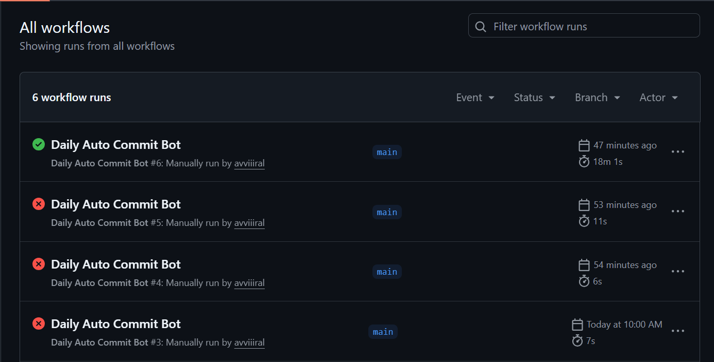
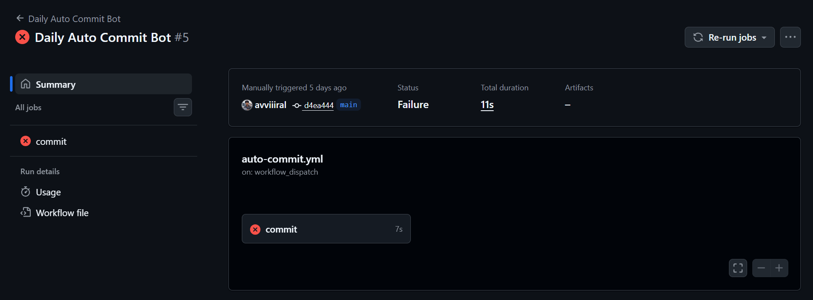
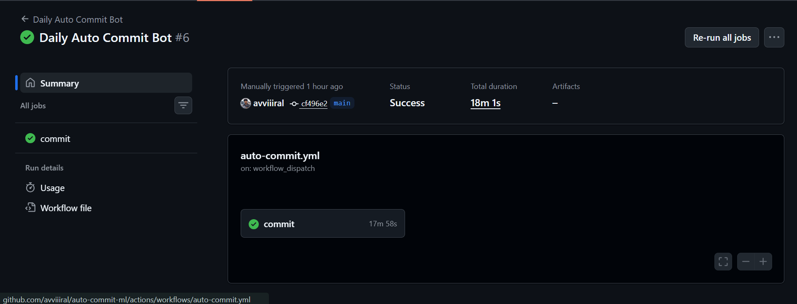
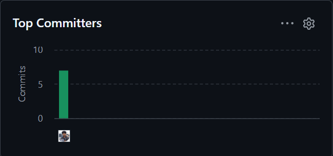

# 🤖 Daily Auto Commit Bot

An automated GitHub Actions bot that **creates realistic commits daily** across your repositories.  
It randomly selects **one repository per day** and makes **3–5 spaced commits**, helping you practice GitHub automation and maintain consistent activity.

---

## ✨ Features

- ✅ Runs **fully on GitHub Actions** (no laptop needed)
- 🎯 Picks **one random repo per day**
- 🔁 Makes **3–5 commits per run**
- ⏱️ Random delay between commits (natural timing)
- 🔐 Uses **GitHub Personal Access Token (PAT)**
- 🌱 Commits count toward **GitHub contribution graph**
- ▶️ Supports **manual trigger** (`workflow_dispatch`)

---

## 🗂 Repository Structure

```
auto-commit-ml/
│── scripts/
│   └── auto_commit.py
│── .github/
│   └── workflows/
│     └── auto-commit.yml
│── repos.txt
│── README.md
```

---

## 📄 How It Works

1. GitHub Actions runs once per day (or manually).
2. The script reads `repos.txt`.
3. One repository is chosen **randomly**.
4. The bot:
   - clones the repo
   - creates dummy files
   - commits changes 3–5 times
   - pushes them back
5. Commits appear on your **GitHub contribution graph**.

---

## 🛠 Setup Guide

### 1️⃣ Create `repos.txt`

Add repositories you want to auto-commit to (one per line):

```
avviiiral/Bank-Note-Authentication-using-Random-Forest
avviiiral/Employee-Salary-Prediction-using-Linear-Regression
avviiiral/Breast-Cancer-Classification-with-a-simple-Neural-Network-NN-
```

❌ Do NOT include this repo (`auto-commit-ml`)  
❌ Avoid forks / archived repos

---

### 2️⃣ Create a GitHub Personal Access Token (PAT)

- GitHub → Settings → Developer settings → Personal access tokens
- Type: **Fine-grained**
- Repository access: **All repositories**
- Permissions:
  - Contents → **Read & Write**
  - Metadata → **Read**

---

### 3️⃣ Add PAT as GitHub Secret

Repo → **Settings → Secrets and variables → Actions → New repository secret**

```
Name: GH_PAT
Value: <your_token_here>
```

⚠️ Paste ONLY the token (no spaces, no extra text).

---

### 4️⃣ Run the Workflow

- Go to **Actions**
- Select **Daily Auto Commit Bot**
- Click **Run workflow**

⏱️ The job may take **5–25 minutes** due to random delays.

---

## 📸 Screenshots

> Add screenshots after running the workflow successfully.  
> Upload images to the repository and update paths below.

### ✅ GitHub Actions – Workflow Running


### ❌ Failed Run (Debugging)


### 🟢 Successful Commits


### 🌱 Contribution Graph


---

## ⏱ Why the Workflow Takes Time

Commits are intentionally spaced to look natural:

```python
time.sleep(random.randint(60, 300))
```
This avoids spam-like behavior and mimics real development activity.

---

🟢 Contribution Graph Notes

- To ensure commits show as green squares:

- Use the same email as your GitHub account

- Commits must be pushed to the default branch

---

⚠️ Important Notes

- This project is for learning GitHub Actions & automation

- Avoid abusing automated commits

- Keep commits meaningful in real projects

---

🚀 Possible Enhancements

- Skip weekends

- Avoid repeating the same repo

- Randomize execution time per day

- Commit real code changes instead of dummy files

---

📜 License

- MIT License

---

🙌 Author

Aviral Goyal
GitHub: https://github.com/avviiiral
